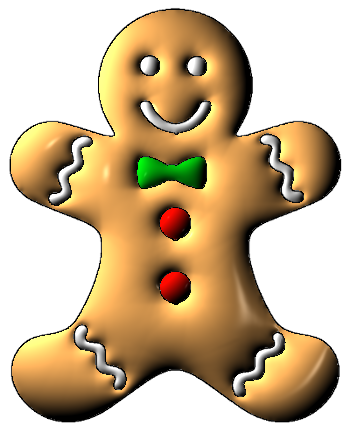

# Iluminação de Cartoon
Este trabalho apresenta uma técnica para iluminação local de cartoons 2D fazendo uso de uma estrutura de dados que contém informações geométricas e topológicas dos objetos presentes na imagem que compõem um cartoon. Tal estrutura nos dá o cartoon como um conjunto de regiões composta por: pontos internos, borda e curvas internas. O processo de iluminação faz uso de um cálculo de interpolação de normais 2D.

Trabalho desenvolvido por:
<ul>
  <li>Allan Rocha</li>
  <li>Renata Thomas</li>
  <li>Fabiane Pin</li>
  <li>Ailton Felix</li>
  <li>Adelailson Peixoto</li>
</ul>

Implementado em C++. Use uma IDE, como o Eclipse, para executá-lo.

O código tem dependências de algumas bibliotecas, são elas: 
<ol>
  <li>fltk1.1 (FLTK)</li>
  <li>libglu1-mesa-dev freeglut3-dev mesa-common-dev (OpenGL)</li>
  <li>imagemagick (ImageMagick)</li>
</ol>

# Resultados

Screenshot da aplicação. Com a imagem original dada como entrada à esquerda, e o resultado à direita, com o efeito de iluminação aplicado.
  

Outro resultado:

 
